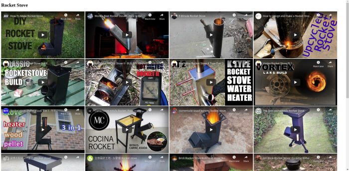

# rocket_stove_yt_iframes
Rocket Stove YT Iframes: Python 3, Flask app, Jinja 2 template, csv.reader()



---


## Run App

Navigate to the root directory of `rocket_stove` and run the app:

```shell
. .run.sh
```

```shell
#! /bin/dash

export FLASK_ENV=development
export FLASK_APP=rocket_stove
flask run
```

- `dash` is basically the same thing as `bash`, as they are both Unix shells, but dash is smaller.
- `export FLASK_ENV=development` environmental variable sets the Flask app to `development` mode, which includes a debugger.
- `export FLASK_APP=rocket_stove` environmental variable tells Flask which app to run.
- `flask run` starts the Flask app


---


## Shebang/Interpreter Directive

`#! /bin/python3`

First of all, the [Unix shebang](https://en.wikipedia.org/wiki/Shebang_(Unix)) line is ignored by the Python executable file because that line starts with a `#` character which leads a comment string.

> The shebang is actually a human-readable instance of a magic number in the executable file, the magic byte string being **0x23 0x21**, the two-character encoding in ASCII of `#!`. This magic number is detected by the **exec** family of functions, which determine whether a file is a script or an executable binary. The presence of the shebang will result in the execution of the specified executable, usually an interpreter for the script's language.<sub>1</sub>

In this case, the _interpreter of the script's language_ is `/bin/python3`.


---


## Module `__doc__`

```Python
'''`rocket_stove` module contains `rocket_stove()` method which renders \
a template of YouTube links.'''
```

Python's interactive shell can be used to access that `__doc__` string.

```python
>>> __doc__
'`rocket_stove` module contains `rocket_stove()` method which renders a template of YouTube links.'
```

This documentation is used to describe the module.

The line break character `\` can be added to restrict a newline character from appearing in the doc string.


---


## Imports

```python
from csv import reader
from flask import Flask
from flask import render_template
```

- [csv.reader()](https://docs.python.org/3/library/csv.html#csv.reader) returns a reader object assigned to `_reader` which iterates over records in `csv/rocket_stove.csv`.
- A Flask app is an [instance of the Flask class](https://flask.palletsprojects.com/en/1.1.x/tutorial/factory/#application-setup). Everything about the application, such as configuration and URLs, will be registered with **Flask**.
- `flask.render_template()` is used to render a [Jinja 2 template](https://jinja.palletsprojects.com/en/2.11.x/templates/#synopsis).


---


## Variables

```python
APP = Flask(__name__)  # initialize Flask instance
VIDEO_TITLE = []  # list of video titles
URL_PROF_MAT = {}  # dict values: URL, profile name, stove material
```

- `APP = Flask(__name__)` initializes the Flask instance.
- `VIDEO_TITLE = []` initializes the list where video titles will be appended.
- `URL_PROF_MAT = {}` initializes dictionary where video title keys and URL values are assigned.


---


## `rocket_stove()` Method

`rocket_stove` module can be imported into the Python interactive shell, which enables access to the method's documentation, for example:

```
>>> import rocket_stove
>>> dir(rocket_stove)
['APP', 'Flask', 'URL_PROF_MAT', 'VIDEO_TITLE', '__builtins__', '__cached__', '__doc__', '__file__', '__loader__', '__name__', '__package__', '__spec__', 'reader', 'render_template', 'rocket_stove']
>>> rocket_stove.rocket_stove.__doc__
'`rocket_stove()` method renders list of YouTube links to a template.'
```

### File I/O

- the [open()](https://docs.python.org/3/library/functions.html#open) built-in function opens `csv/rocket_stove.csv` for reading in text mode with `'UTF-8'` encoding, as demonstrated below:

```python
>>> open('csv/rocket_stove.csv')
<_io.TextIOWrapper name='csv/rocket_stove.csv' mode='r' encoding='UTF-8'>
```

### CSV Reader

- [csv.reader()](https://docs.python.org/3/library/csv.html#csv.reader) returns a reader object which iterates over records in `csv/rocket_stove.csv`.

```python
>>> _file = open('csv/rocket_stove.csv')
>>> rocket_stove.reader(_file)
<_csv.reader object at 0x7fea494d72e0>
```

- `next(_reader)` is used to skip the first row of the CSV file which is a title row, and which advances to the first record of the database in the second line. The first row of that database contains `Title,URL`.

### Looping Structure

A [for](https://docs.python.org/3/tutorial/controlflow.html#for-statements) statement is used to iterate through the CSV reader object:

```python
>>> _reader = rocket_stove.reader(_file)
>>> for i in _reader:
...     print(i)
...
['Title', 'URL']
['How To Make Rocket Stove', 'SYYSuHulf-4']
["World's Best Rocket Stove!! - How to Build a Simple Camp Stove", 'GMcDekiRKs8']
['5 Minute Rocket Stove', 'dwZitmJl7zY']
['How to design and make a Rocket Stove Griddle', 's_aKIs8sYPk']
['The Classic Rocket Stove Build', 'X8OOZuJcTFE']
['Hot Water Rocket Stove II - BUILD-', 'PBI4LaeKxDE']
['Hot Water Rocket Stove K Type Part 2', '7wRszNLpuc0']
['Vortex Rocket Stove Pt 1', 'UBIBW1z2gks']
['Rocket stove (Pellet; wood).3 in 1. 거꾸로 타는 난로 만들기', 'uQ2MP6ryYCw']
['Como hacer estufa Rocket. Paso a paso / Handmade rocket stove.', 'JQ8axWRoEtA']
['Homemade wood burning Rocket stove', '9-r4VLHQRlM']
['The Best Homemade Rocket Stove', 'B-9qo6P4NQU']
['로켓스토브 고기불판 (Rocket stove)', 'jjsObiA3Heg']
['立佳設計工坊 - 火箭爐 Rocket stove', 'ug7jmoHf-Bg']
['Brick Rocket Stove Build And Water Boil Test vs Stove Top', 'Z_Rozs12174']
['DIY Brick Rocket Stove - Cooking Without Electrical Power', 'onMbSLuC7Oc']
['How to build a better brick rocket stove for $10', 'r66jjYdBmg8']
['Build Your Own Brick Rocket Stove', 'GRZM8pdsjyc']
['J shaped gravity fed brick rocket stove', 'v26b3jrylEc']
['Rocket stove en briques', 'TqW5Kse3ft0']
['How To Make A Concrete And Perlite Rocket Stove', 'TYr-Uj4HqDs']
```

### Variables

- `VIDEO_TITLE` is a list of all of the video titles which will also be used as keys to select the associated URLs.
- `URL` contains key/value pairs of video titles/URLs, e.g. `'How To Make Rocket Stove': ['SYYSuHulf-4']`

```python
>>> VIDEO_TITLE = []
>>> URL = {}
>>> import rocket_stove
>>> _file = open('csv/rocket_stove.csv')
>>> _reader = rocket_stove.reader(_file)
>>> for record in _reader:
...     VIDEO_TITLE.append(record[0])
...     URL_PROF_MAT[record[0]] = [record[1]]
...
>>> VIDEO_TITLE
['Title', 'How To Make Rocket Stove', "World's Best Rocket Stove!! - How to Build a Simple Camp Stove", '5 Minute Rocket Stove', 'How to design and make a Rocket Stove Griddle', 'The Classic Rocket Stove Build', 'Hot Water Rocket Stove II - BUILD-', 'Hot Water Rocket Stove K Type Part 2', 'Vortex Rocket Stove Pt 1', 'Rocket stove (Pellet; wood).3 in 1. 거꾸로 타는 난로 만들기', 'Como hacer estufa Rocket. Paso a paso / Handmade rocket stove.', 'Homemade wood burning Rocket stove', 'The Best Homemade Rocket Stove', '로켓스토브 고기불판 (Rocket stove)', '立佳設計工坊 - 火箭爐 Rocket stove', 'Brick Rocket Stove Build And Water Boil Test vs Stove Top', 'DIY Brick Rocket Stove - Cooking Without Electrical Power', 'How to build a better brick rocket stove for $10', 'Build Your Own Brick Rocket Stove', 'J shaped gravity fed brick rocket stove', 'Rocket stove en briques', 'How To Make A Concrete And Perlite Rocket Stove']
>>> URL_PROF_MAT
{'Title': ['URL'], 'How To Make Rocket Stove': ['SYYSuHulf-4'], "World's Best Rocket Stove!! - How to Build a Simple Camp Stove": ['GMcDekiRKs8'], '5 Minute Rocket Stove': ['dwZitmJl7zY'], 'How to design and make a Rocket Stove Griddle': ['s_aKIs8sYPk'], 'The Classic Rocket Stove Build': ['X8OOZuJcTFE'], 'Hot Water Rocket Stove II - BUILD-': ['PBI4LaeKxDE'], 'Hot Water Rocket Stove K Type Part 2': ['7wRszNLpuc0'], 'Vortex Rocket Stove Pt 1': ['UBIBW1z2gks'], 'Rocket stove (Pellet; wood).3 in 1. 거꾸로 타는 난로 만들기': ['uQ2MP6ryYCw'], 'Como hacer estufa Rocket. Paso a paso / Handmade rocket stove.': ['JQ8axWRoEtA'], 'Homemade wood burning Rocket stove': ['9-r4VLHQRlM'], 'The Best Homemade Rocket Stove': ['B-9qo6P4NQU'], '로켓스토브 고기불판 (Rocket stove)': ['jjsObiA3Heg'], '立佳設計工坊 - 火箭爐 Rocket stove': ['ug7jmoHf-Bg'], 'Brick Rocket Stove Build And Water Boil Test vs Stove Top': ['Z_Rozs12174'], 'DIY Brick Rocket Stove - Cooking Without Electrical Power': ['onMbSLuC7Oc'], 'How to build a better brick rocket stove for $10': ['r66jjYdBmg8'], 'Build Your Own Brick Rocket Stove': ['GRZM8pdsjyc'], 'J shaped gravity fed brick rocket stove': ['v26b3jrylEc'], 'Rocket stove en briques': ['TqW5Kse3ft0'], 'How To Make A Concrete And Perlite Rocket Stove': ['TYr-Uj4HqDs']}
```

### Render Template

- `render_template('template.htm', video_title=VIDEO_TITLE, url=URL)` renders the Jinja2 template.


---


## Twitter Hashtags

- [#Python3](https://twitter.com/hashtag/python3?f=live)
- [#PythonScripting](https://twitter.com/hashtag/PythonScripting?f=live)
- [#PythonCoding](https://twitter.com/hashtag/PythonCoding?f=live)
- [#LearnPython](https://twitter.com/hashtag/LearnPython?f=live)
- [#Scripting](https://twitter.com/hashtag/Scripting?f=live)
- [#LearnToCode](https://twitter.com/hashtag/LearnToCode?f=live)
- [#100DaysOfCode](https://twitter.com/hashtag/100DaysOfCode?f=live)
- [#DeveloperLife](https://twitter.com/hashtag/DeveloperLife?f=live)
- [#DevLife](https://twitter.com/hashtag/DevLife?f=live)
- [#Coder](https://twitter.com/hashtag/Coder?f=live)
- [#CodeNewbies](https://twitter.com/hashtag/CodeNewbies?f=live)
- [#Coding](https://twitter.com/hashtag/Coding?f=live)
- [#Code](https://twitter.com/hashtag/Code?f=live)
- [#CodingLife](https://twitter.com/hashtag/CodingLife?f=live)
- [#CodeNewbie](https://twitter.com/hashtag/CodeNewbie?f=live)
- [#Coders](https://twitter.com/hashtag/Coders?f=live)
- [#CodingIsFun](https://twitter.com/hashtag/CodingIsFun?f=live)

<sup>1</sup> [magic number](https://en.wikipedia.org/wiki/Shebang_\(Unix\)#Magic_number)
